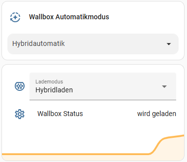

# Energie Impuls Integration für Home Assistant

Diese benutzerdefinierte Home Assistant-Integration verbindet dein Smart Home mit dem [Energie Impuls](https://energie-impuls.site). Sie liest Energiedaten aus und ermöglicht das Steuern der Wallbox direkt über Home Assistant. Ausserdem stellt sie intelligente Ladeautomatiken zur Verfügung.

## ⚙️ Funktionen

- **Live-Sensoren**:
  - PV-Erzeugung, Netzeinspeisung, Haushaltsverbrauch,...
  - Batterie-SOC (State of Charge)
  - Wallbox-Verbrauch & -Modus
- **Wallbox-Steuerung, wie in der Energie-Impuls App**
- **Logik-Elemente**:
  - Lademodus statt einzelne Wallbox-Schalter
  - Ladeautomatik um bei maximiertem Eigenverbrauch trotzdem morgens das Auto voll geladen zu haben


### Beispiel im Dashboard


```yaml
- type: tile
  features_position: bottom
  vertical: false
  grid_options:
    columns: full
  entity: select.wallbox_automatikmodus
  hide_state: true

- type: entities
  entities:
    - entity: select.wallbox_lademodus
      name: Lademodus
    - entity: sensor.knx_wallbox_modus
      name: Wallbox Status
  footer:
    type: graph
    entity: sensor.energie_impuls_wallbox_verbrauch
```

---

## 🔧 Installation über HACS (empfohlen)

1. Öffne HACS → **Integrationen**
2. Klicke auf das Menü (⋮) → **Benutzerdefiniertes Repository hinzufügen**
3. Gib folgendes ein: https://github.com/doenke/ha-energie-impuls, Wähle **Integration** als Typ.
4. Nach Installation: Home Assistant neustarten
5. Gehe zu **Einstellungen → Geräte & Dienste → Integration hinzufügen**
6. Wähle **Energie Impuls**, trage Benutzername und Passwort ein

---

## 🧾 Manuelle Installation (alternativ)

1. Lade das [ZIP-Archiv](https://github.com/doenke/ha-energie-impuls/archive/refs/heads/main.zip) herunter
2. Entpacke es und kopiere den Ordner `custom_components/energie_impuls/` nach: config/custom_components/energie_impuls/
3. Starte Home Assistant neu

---

## ⚙️ Konfiguration (über UI)

Die Integration wird komplett über das Home Assistant-UI konfiguriert. Es sind folgende Angaben notwendig:

- `Benutzername`: Dein Login bei energie-impuls.site
- `Passwort`: Dein Passwort

Nach erfolgreichem Login wird ein Zugriffstoken gespeichert und automatisch erneuert, falls nötig.

---

## 📊 Verfügbare Entitäten

| Entity ID                               | Typ     | Beschreibung                                                                 |
|----------------------------------------|---------|------------------------------------------------------------------------------|
| sensor.pv                              | Sensor  | Aktuelle PV-Erzeugung in kW                                                 |
| sensor.to_grid                         | Sensor  | Aktuelle Netzeinspeisung in kW                                              |
| sensor.to_battery                      | Sensor  | Batterieladung in kW                                                        |
| sensor.household                       | Sensor  | Haushaltsverbrauch in kW                                                    |
| sensor.battery_soc                     | Sensor  | Batterieladestand in Prozent                                                |
| sensor.wallbox_mode_str                | Sensor  | Aktueller Wallbox-Modus als lesbarer Text                                   |
| sensor.wallbox_mode                    | Sensor  | Aktueller Wallbox-Moduscode (numerisch)                                     |
| sensor.wallbox_consumption            | Sensor  | Stromverbrauch der Wallbox in kW                                            |
| sensor.wallbox_mode_knx                | Sensor  | Gekürzter Wallbox-Modus für KNX-Anbindung (ohne „Fahrzeug“)                |
| switch.energie_impuls_switch_locked    | Switch  | Sperrt oder entsperrt die Wallbox                                           |
| switch.energie_impuls_switch_surplus_charging | Switch | Schaltet das Überschussladen der Wallbox ein/aus                         |
| switch.energie_impuls_automatic_status | Switch  | Aktiviert oder deaktiviert die Automatiklogik                               |
| select.energie_impuls_wallbox_mode     | Select  | Manuelle Auswahl des Lademodus (Schnellladen, Hybrid, etc.)                |
| select.energie_impuls_automatic_mode   | Select  | Wahl des Automatikmodus (z. B. Hybrid-Automatik, Überschuss, etc.)         |
| number.energie_impuls_hybrid_current   | Number  | Einstellbarer Hybrid-Ladestrom in Ampere (0 = deaktiviert)                  |


---

# 🔄 Automatikmodus
Die Integration bietet einen leistungsfähigen Automatikmodus, der die Wallbox je nach PV-Erzeugung und gewähltem Modus automatisch steuert.

## 🧠 Funktionsweise
Die Automatik analysiert regelmäßig die aktuelle PV-Erzeugung und entscheidet abhängig vom gewählten Modus, ob und wie die Wallbox laden soll. Dabei kommen verschiedene Strategien zum Einsatz, zum Beispiel:

| Automatikmodus             | Beschreibung  | Modus über PV Schwelle |  Modus unter PV Schwelle |
| :------------------------- | :------------ | :--------------------: | :----------------------: |
| **Hybrid-Automatik**       | Wallbox lädt nur dann im Hybrid‑Modus (mit mind. 6 A), wenn die PV‑Erzeugung für eine gewisse Zeitspanne (z. B. 10 Minuten) über einem konfigurierbaren Schwellenwert liegt (z. B. 1,5 kW). Andernfalls wird der Ladevorgang beendet. Somit kann auch bei geringerer Sonneneinstrahlung der ins Auto geladene Strom maximiert werden.  | Hybrid | Überschuss |
| **Überschussladen**        | Es wird nur geladen, wenn tatsächlich ein PV‑Überschuss vorhanden ist.   | Überschuss |  |
| **Sofortladen**            | Die Wallbox wird dauerhaft auf Laden gesetzt, unabhängig von der PV‑Erzeugung.  | Normal  |  |
| **Überschuss, über Nacht voll**    | Überschussladen, bei unzureichender PV‑Leistung wird auf Sofort-Laden umgeschaltet. Damit ist sichergestellt, dass das Auto am nächsten Morgen auf jeden Fall voll geladen ist.  | Überschuss | Normal  |
| **Hybrid, über Nacht voll**  | Hybridladen, bei unzureichender PV‑Leistung wird auf Sofort-Laden umgeschaltet. Damit ist sichergestellt, dass das Auto am nächsten Morgen auf jeden Fall voll geladen ist.  | Hybrid | Normal  |
| **Manuell**                | Diese Einstellung macht nichts und erlaubt eine dauerhafte manuelle Bedienung.  |  |  |

Normal bedeutet, dass keine Wallbox-Features aktiviert sind. Die Wallbox läd einfach ganz normal.
 
Diese Modi lassen sich bequem über das select.wallbox_automatikmodus-Entity auswählen.
## Überschreiben der Automatik
Sobald irgendein Parameter von Hand umgestellt wird, so schaltet sich die Automatik ab. Wenn der Wallbox-Zustand sich auf "Fahrzeug nicht verbunden" (Auto wurde abgeklemmt) ändert, dann aktiviert sich die Automatik von selbst wieder, um den nächsten Ladevorgang wieder über die Automatik zu steuern. Wer das nicht möchte, der sollte den Automatik-Modus "Manuell" auswählen.

## ⚙️ Optionen (über UI)
- `Mindest-PV-Leistung in kW`: Schaltschwelle für Logikfunktionen. Ab diesem Solarertrag schalten die Logiken um
- `Dauer der Über-/Unterschreitung in Minuten`: Die Schaltschwelle muss für diese Anzahl Minuten über- oder unterschrittenwerden, damit umgeschaltet wird.

# 🧑‍💻 Wünsche an Planville
- Bereitstellung der Gesamt-Zählerwerte über die API, um das HA Energie Dashboard auch ohne die unzuverlässige China Cloud nutzen zu können
- Zugriff auf den Wechselrichter, um den Modus einstellen zu könnn, ob Last zuerst aus dem Netz oder aus der Batterie genommen wird, um eine Schonfunktion für die Batterie zu bauen
- Eine lokale API, um den Umweg über das Internet unnötig zu machen
- Zugriff auf die API über einen festen Token

# TODO
- Solarprognose einbauen
   - Strombedarf Auto
   - Solarprognose
   - Automatisch Modus bestimmen, um morgen früh voll zu sein 

## 🧑‍💻 Mitwirken

Pull Requests, Bug Reports und Verbesserungsvorschläge sind willkommen. Bitte beschreibe deine Änderungen klar und verständlich.

---

## 📜 Lizenz

MIT License – siehe [LICENSE](LICENSE)

